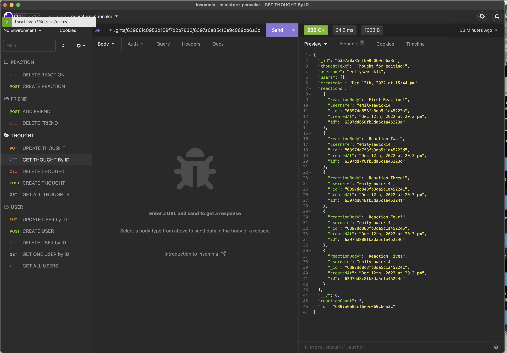

# miniature-pancake

## Description 
https://drive.google.com/file/d/1N6OZgRS5TrZB2EiVJwmFcWeyigZi5_j-/view 

This application is the back end of a social media website using a NOSQL database. 

## Table of Contents 

[Usage](#usage) 
[Road Map](#road-map) 
[License](#license)

## Usage 
This is link to view a video walkthrough of the application:
https://drive.google.com/file/d/1N6OZgRS5TrZB2EiVJwmFcWeyigZi5_j-/view

First, the user will type 

> npm start

into the application terminal to create a connection with the local host. The user can then navigate to insomnia to test the api routes.  

Once in insomnia, the user can get all users, create a user, and get one, update, and delete a user by it's id. Through the user route, users are associated with each other through a friends list. At the end of the friends array, there is a counter to indicate now many friends each user has. A friend can be added and removed from the friend list by using it's id. When the friend is removed, the counter indicates one less friend in the list, but the user is not deleted from the application as a whole, just from the friend list. 

In addition to editing users, individuals can get all thoughts and their associated reactions, create thoughts, and get one, update, and delete a thought by it's id. 

The application also allows for other users to react to thoughts using a thought's id and to delete those reactions using the reaction id. Underneath the reaction array, there is a counter that indicates how many reactions are associated with each thought. As reactions are added and removed, the counter increases and descreases respecitvely. 

## Road Map

Future iterations of this application will include a front end to create a fully functioning social media website. 

## License 